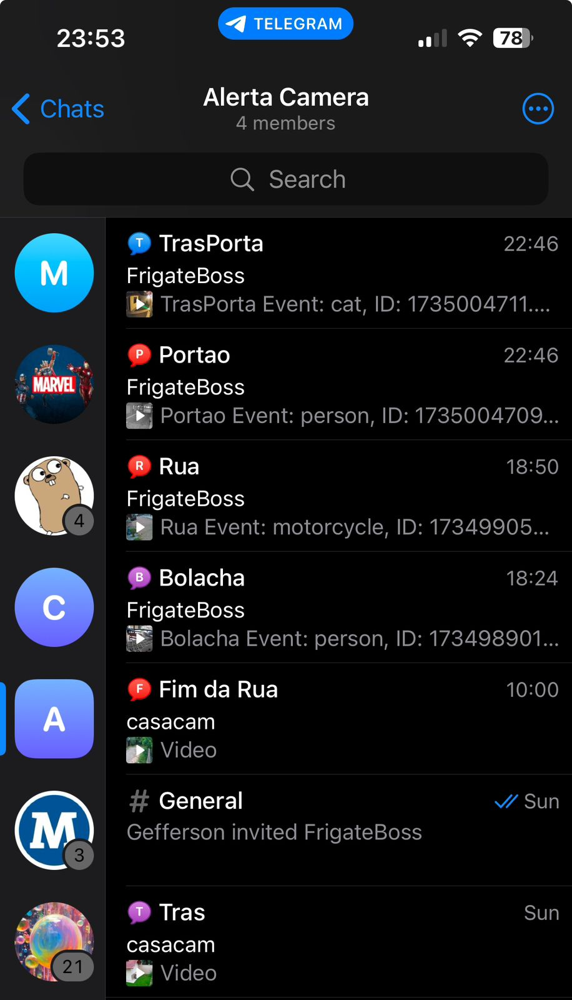
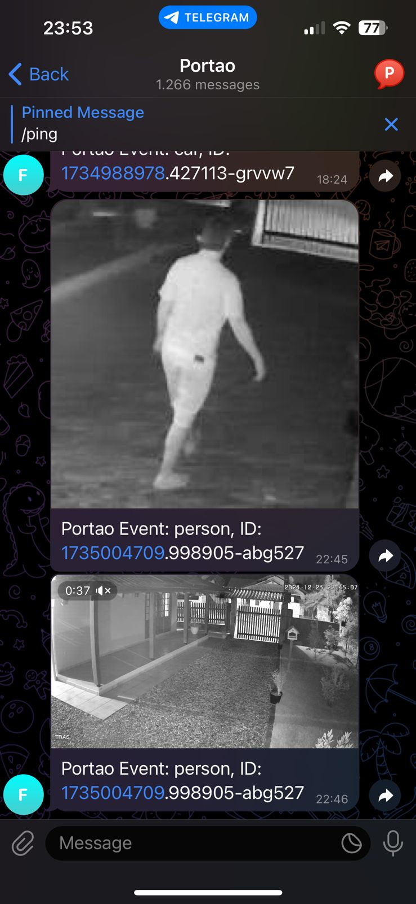
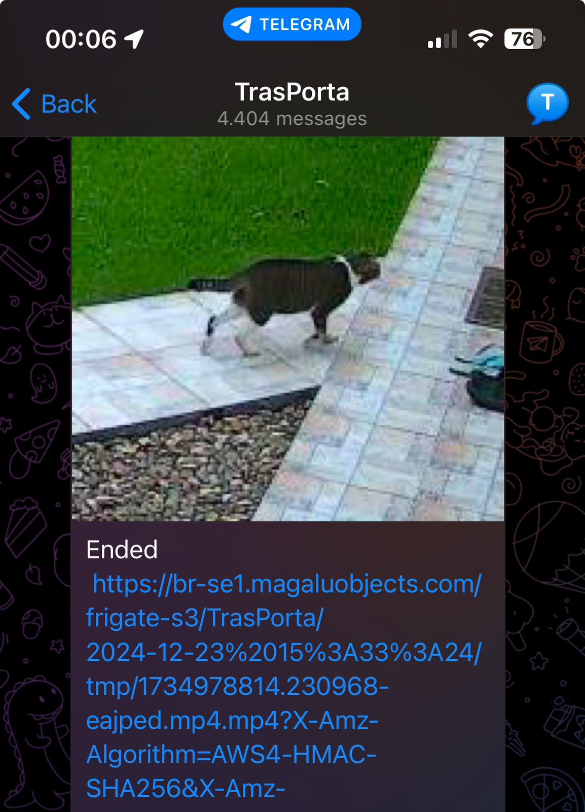
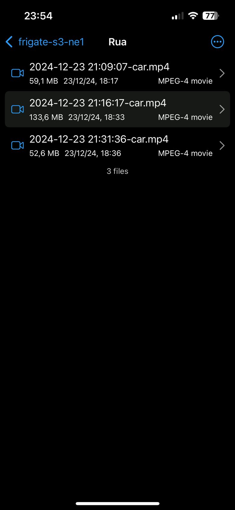

# Frigate-S3-Telegram

Frigate-S3-Telegram is a Go-based application that integrates Frigate, S3, and Telegram to manage and notify about security events. The application fetches events from Frigate, processes them, and sends notifications to a Telegram bot. It also stores event data in an S3 bucket and uses RabbitMQ for message queuing.

## Features

- Fetch events from Frigate
- Send event snapshots to Telegram
- Store event data in an S3 bucket
- Use RabbitMQ for message queuing
- Redis for caching event IDs

## Architecture

  
Screenshots

  
  ### Telegram

  ### Bucket

  

  

